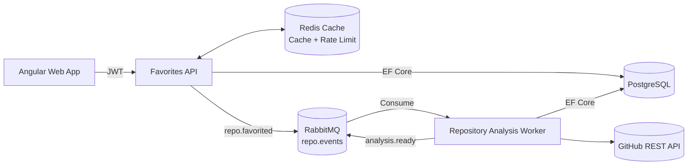
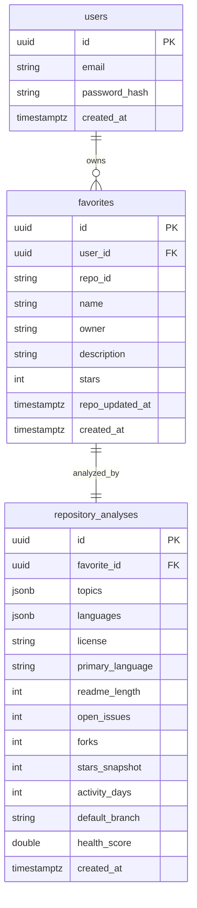

## GitHub Favorites

Full-stack sample that lets authenticated users search GitHub repositories, favorite them, and review an automated analysis generated by a RabbitMQ-driven worker. Stack: .NET 8 Web API + Worker, Angular 17, PostgreSQL, Redis, RabbitMQ, Docker.

### Quick Start
- Install Docker Desktop and ensure ports `5092`, `8081`, `5432`, `5672`, `6379`, `15672`, `5050` are free.
- Gather GitHub credentials (details below), then run compose:
  ```bash
  GITHUB_PAT=ghp_xxx \
  GITHUB_CLIENT_ID=your_client_id \
  GITHUB_CLIENT_SECRET=your_client_secret \
  docker compose up --build
  ```
- Open `http://localhost:8081` (web) and log in with the seeded demo user:
  - Email: `demo@githubfavorites.local`
  - Password: `ChangeMe123!`
- Alternatively, use GitHub OAuth login via the login page once your OAuth app is configured.

### Configuring GitHub Credentials
| Credential | Where to create it | Required scopes/settings | Where to place it in this repo |
| --- | --- | --- | --- |
| Personal Access Token (PAT) | GitHub → Settings → **Developer settings** → **Personal access tokens** → **Fine-grained tokens** (or classic) ([link](https://github.com/settings/tokens)) | `repo` (read) scope is enough; keep expiration short for local dev | Set as env var `GITHUB_PAT` (preferred). Also replace `GitHub:PersonalAccessToken` in `GitHubFavoritesAPI/FavoritesAPI/appsettings.json` if you need a hard-coded fallback. |
| OAuth Client ID/Secret | GitHub → Settings → **Developer settings** → **OAuth Apps** → **New OAuth App** | Homepage `http://localhost:8081`, Authorization callback URL `http://localhost:5092/auth/github/callback` | Set as env vars `GITHUB_CLIENT_ID` / `GITHUB_CLIENT_SECRET`. They flow into the API via `docker-compose.yml` and mirror placeholders in `GitHubFavoritesAPI/FavoritesAPI/appsettings.json`. |

Use the tokens page above to mint both a PAT and (when logged into a GitHub developer account) to jump into the OAuth Apps section for generating the client id/secret pair. That page is where GitHub exposes the one-time secret string—copy it immediately because GitHub will not show it again later. For OAuth, you can always issue a new client secret from the same dashboard if needed.

**Files to update if you prefer editing configs directly instead of env vars:**
- `GitHubFavoritesAPI/FavoritesAPI/appsettings.json`: `GitHub.PersonalAccessToken`, `GitHub.ClientId`, `GitHub.ClientSecret`.
- `docker-compose.yml`: Environment block for the `api` and `worker` services references `${GITHUB_PAT}`, `${GITHUB_CLIENT_ID}`, `${GITHUB_CLIENT_SECRET}`; override these or edit the defaults.

Never commit real secrets. Use `.env` files locally (ignored by git) or secret stores (Vault, AWS Secrets Manager, etc.) for deployed environments.

### Architecture Diagram


### Async Flow
1. User favorites a repo → API stores the favorite in PostgreSQL and publishes `repo.favorited` event to RabbitMQ exchange `repo.events` with routing key `repo.favorited`.
2. Worker consumes from queue `repo.favorited.queue`, calls GitHub endpoints:
   - Repository details (`/repos/{owner}/{name}`)
   - Topics (`/repos/{owner}/{name}/topics`)
   - Languages (`/repos/{owner}/{name}/languages`)
   - README (`/repos/{owner}/{name}/readme`)
   - License (from repo details)
3. Worker computes the deterministic health score, upserts `repository_analyses` in PostgreSQL, then emits `analysis.ready` event.
4. Favorites API hydrates analyses when listing favorites via JOIN query.
5. **Retry mechanism**: Failed messages are retried up to 3 times via `repo.favorited.retry.queue` before moving to Dead Letter Queue `repo.favorited.dlq.queue`.

### Data Model


### Health Score Formula
Documented in `RepositoryAnalysisWorker.Services.HealthScoreCalculator` and used both in the worker and tests:

```
healthScore =
    starsScore(starsSnapshot)      // log-scale vs 50k stars, up to 40 pts
    + activityScore(activityDays)  // recency over the past year, up to 30 pts
    + engagementScore(forks, openIssues) // forks/issues balance, up to 20 pts
    + readmeScore(readmeLength)    // README depth vs 5k chars, up to 10 pts
```

- `starsScore = log10(stars + 1) / log10(50001) * 40`
- `activityScore = (1 - clamp(activityDays, 0, 365) / 365) * 30`
- `engagementScore = clamp((forks / (openIssues + 1)) / 4, 0, 1) * 20`
- `readmeScore = clamp(readmeLength / 5000, 0, 1) * 10`

The combined score is capped at 100, rounded to two decimals, and the SPA surfaces it as `Health nn/100` with a tooltip that recaps the four factors.

### Frontend Highlights
- Standalone Angular 17 app with Angular Material.
- **Login page**: Email/password authentication or GitHub OAuth login.
- **Search page**: 
  - Search input with debounced queries
  - Pagination (page, perPage)
  - Results display with favorite button
  - Optimistic UI updates when favoriting
  - Repo titles deep-link to GitHub and show the last push timestamp
- **Favorites page**: 
  - Lists all user favorites
  - Shows pending state while analysis is processing
  - Displays full analysis when ready (topics, languages, health score, metrics)
  - Remove favorite functionality
  - Health chip now surfaces `Health nn/100` with a tooltip describing the scoring blend, and repo headers link out to GitHub
- HTTP interceptor injects JWTs automatically, `MatSnackBar` surfaces API errors, and Angular tests cover the API client.

### API Surface
| Method | Path | Description |
| --- | --- | --- |
| POST | `/auth/login` | Returns JWT for email/password authentication |
| GET | `/auth/github` | Initiates GitHub OAuth flow (optional) |
| GET | `/auth/github/callback` | GitHub OAuth callback handler |
| GET | `/api/search?q=&page=&perPage=` | Proxy to GitHub search with Redis caching (90s TTL) + per-user rate limit (10 req/min) |
| POST | `/api/favorites` | Persists a favorite + publishes `repo.favorited` event (returns 202 Accepted) |
| GET | `/api/favorites` | Returns favorites with optional analysis snapshot |
| DELETE | `/api/favorites/:repoId` | Removes a favorite |
| GET | `/health` | Verifies API, PostgreSQL, Redis, RabbitMQ connectivity |

### Environment Variables
| Service | Key | Purpose | Default |
| --- | --- | --- | --- |
| API | `ConnectionStrings__Postgres` | Database connection | - |
| API | `Redis__ConnectionString` | Redis cache & rate limiter | `localhost:6379` |
| API | `Redis__SearchCacheTtlSeconds` | Search cache TTL | `90` |
| API | `RateLimit__SearchRequestsPerMinute` | Per-user rate limit | `10` |
| API/Worker | `GitHub__PersonalAccessToken` | GitHub PAT (keep secret) | - |
| API | `GitHub__ClientId`, `GitHub__ClientSecret` | GitHub OAuth (optional) | - |
| API/Worker | `RabbitMq__HostName`, `RabbitMq__Port`, etc. | Broker configuration | See `appsettings.json` |
| API | `Jwt__SigningKey`, `Jwt__AccessTokenMinutes` | JWT signing | `120` minutes |
| Worker | `ConnectionStrings__Postgres` | Same DB to upsert analyses | - |
| Web | `environment.production.ts` | API base URL | `http://localhost:5092` |

**RabbitMQ Configuration:**
- Exchange: `repo.events` (Topic)
- Queue: `repo.favorited.queue`
- Routing Key: `repo.favorited`
- Retry Exchange: `repo.favorited.retry` (Topic)
- Retry Queue: `repo.favorited.retry.queue` (TTL: 10s)
- DLQ Exchange: `repo.favorited.dlq` (Fanout)
- DLQ Queue: `repo.favorited.dlq.queue`
- Analysis Ready Routing Key: `analysis.ready`

**Secrets:** Compose accepts `GITHUB_PAT`/`JWT_SIGNING_KEY` as environment variables. For production use secret stores (Azure Key Vault, AWS Secrets Manager, Kubernetes Secrets) and never bake tokens into images.

### Docker Compose
Services: `postgres`, `redis`, `rabbitmq` (with management UI), `api`, `worker`, `web`, optional `pgadmin`.

```bash
GITHUB_PAT=ghp_xxx docker compose up --build
```

**Service URLs:**
- Angular Web App: `http://localhost:8081` (nginx)
- Favorites API: `http://localhost:5092` (Swagger: `http://localhost:5092/swagger`)
- RabbitMQ Management UI: `http://localhost:15672` (username: `github_favorites`, password: `github_favorites_password`)
- pgAdmin: `http://localhost:5050` (email: `admin@example.com`, password: `admin`)

### Testing
- **Backend**: 
  ```bash
  dotnet test GitHubFavoritesAPI/GitHubFavoritesAPI.sln
  ```
  - `HealthScoreCalculatorTests`: Validates the health score formula with multiple test cases
  
- **Frontend**: 
  ```bash
  cd GitHubFavoritesSite
  npm install
  npm run test
  ```
  - `favorites-api.service.spec.ts`: Tests the API service with HTTP mocking

### Auth Roadmap (Registration & Refresh Tokens)
The assignment doesn’t require full registration/refresh flows, but the plan is documented:
1. **Registration endpoint + UI** – collect email & password, hash via `PasswordHasher<T>`, enforce email uniqueness, optionally send verification email.
2. **Refresh tokens** – issue long-lived opaque tokens stored in PostgreSQL with fingerprint + expiry. Expose `/auth/refresh`, rotate tokens on every use, and blacklist on logout.
3. **Frontend** – store access token in memory/localStorage, refresh transparently when near expiry, handle refresh failures by forcing relogin.

### Missing / Future Enhancements
- **`analysis.ready` consumer** – currently only published. A SignalR or SSE hub could push updates to the SPA in real time.
- **Admin & observability UI** – dashboards for DLQ, retries, and analysis history.
- **Advanced search filters** – front-end filtering on license/topics once GitHub search adds facets.

### Tradeoffs & Next Steps

**Architecture Decisions:**
- **Redis dual-purpose**: Used for both caching (search results) and rate limiting (per-user) to minimize infrastructure. At scale, consider separate logical databases or distinct key prefixes.
- **Worker concurrency**: Currently processes messages with `prefetch=2` for controlled throughput. Horizontal scaling via multiple worker replicas is supported and will increase throughput.
- **JSONB storage**: Topics and languages stored as JSONB in PostgreSQL for efficient querying and filtering capabilities.
- **Retry strategy**: Exponential backoff via retry queue with 10s TTL, max 3 retries before DLQ. Consider configurable retry counts and TTLs for production.

**Future Enhancements:**
- **Real-time updates**: Implement SignalR or Server-Sent Events to push `analysis.ready` events to the frontend without polling.
- **OpenAPI contract tests**: Add contract validation between API and SPA to catch breaking changes early.
- **E2E testing**: Add Playwright tests for critical user flows (search, favorite, view analysis).
- **Observability**: Add structured logging, distributed tracing (OpenTelemetry), and metrics dashboards.
- **Secrets management**: Replace hardcoded secrets in compose with managed identities and secret stores (Azure Key Vault, AWS Secrets Manager, Kubernetes Secrets).

