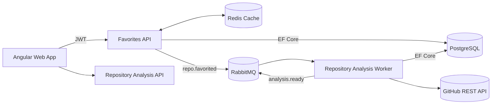
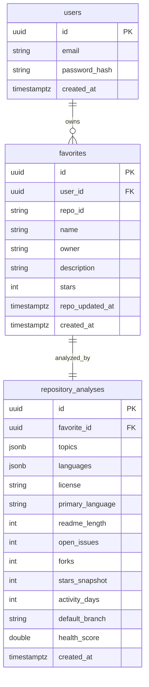

## GitHub Favorites

Full-stack sample that lets authenticated users search GitHub repositories, favorite them, and review an automated analysis generated by a RabbitMQ-driven worker. Stack: .NET 8 Web API + Worker, Angular 17, PostgreSQL, Redis, RabbitMQ, Docker.

### Quick Start
- Install Docker Desktop and ensure ports `8080`, `8081`, `5432`, `5672`, `6379`, `15672`, `5050` are free.
- Provide a GitHub personal access token (repo read scope) when running compose:
  ```
  GITHUB_PAT=ghp_xxx docker compose up --build
  ```
- Open `http://localhost:8081` (web) and log in with the seeded demo user  
  `demo@githubfavorites.local / ChangeMe123!`

### Architecture Diagram


### Async Flow
1. User favorites a repo → API stores the favorite and publishes `repo.favorited`.
2. Worker consumes the event, calls GitHub endpoints (details, languages, topics, README, license).
3. Worker computes the deterministic health score, upserts `repository_analyses`, then emits `analysis.ready`.
4. Favorites API hydrates analyses when listing favorites; the analysis API can be queried independently or by future consumers of `analysis.ready`.

### Data Model


### Health Score Formula
Documented in `RepositoryAnalysisWorker.Services.HealthScoreCalculator` and used both in the worker and tests:

```
healthScore =
    starsSnapshot * 0.4 +
    clamp(30 - activityDays, 0, 30) * 1 +
    (forks / (openIssues + 1)) * 0.6 +
    (readmeLength > 1000 ? 2 : 1)
```

The value is rounded to two decimals when returned to the UI. The README plus worker logs help reason about analyses over time.

### Frontend Highlights
- Standalone Angular 17 app with Angular Material.
- Login page, guarded search and favorites routes.
- Search page handles pagination, Redis-cached backend results, and optimistic favorite enqueueing.
- Favorites page surfaces pending vs. analyzed repositories, showing topics, languages, and computed metrics.
- HTTP interceptor injects JWTs, `MatSnackBar` surfaces API errors, and Angular tests cover the API client.

### API Surface
| Method | Path | Description |
| --- | --- | --- |
| POST | `/auth/login` | Returns JWT for demo user |
| GET | `/api/search?q=&page=&perPage=` | Proxy to GitHub search with Redis caching + per-user rate limit |
| POST | `/api/favorites` | Persists a favorite + publishes `repo.favorited` |
| GET | `/api/favorites` | Returns favorites with optional analysis snapshot |
| DELETE | `/api/favorites/:repoId` | Removes a favorite |
| GET | `/health` | Verifies API, PostgreSQL, Redis, RabbitMQ |

### Environment Variables
| Service | Key | Purpose |
| --- | --- | --- |
| API | `ConnectionStrings__Postgres` | Database connection |
| API | `Redis__ConnectionString` | Redis cache & rate limiter |
| API/Worker | `GitHub__PersonalAccessToken` | GitHub PAT (keep secret) |
| API/Worker | `RabbitMq__*` | Broker configuration |
| API | `Jwt__SigningKey`, `Jwt__AccessTokenMinutes` | JWT signing |
| Worker | `ConnectionStrings__Postgres` | Same DB to upsert analyses |
| Web | baked build uses `environment.production.ts` (`http://localhost:8080`) |

**Secrets:** Compose accepts `GITHUB_PAT`/`JWT_SIGNING_KEY`. For production use secret stores (Azure Key Vault, AWS Secrets Manager, Kubernetes Secrets) and never bake tokens into images.

### Docker Compose
Services: `postgres`, `redis`, `rabbitmq` (with management UI), `api`, `worker`, `web`, optional `pgadmin`.

```
GITHUB_PAT=ghp_xxx docker compose up --build
```

The Angular app is served by nginx on `http://localhost:8081`, the API on `http://localhost:8080`, RabbitMQ UI on `http://localhost:15672`, and pgAdmin on `http://localhost:5050`.

### Testing
- Backend: `dotnet test GitHubFavoritesAPI/GitHubFavoritesAPI.sln`
- Frontend: `npm install` (already in compose build) then `npm run test` (headless Chrome)

### Auth Roadmap (Registration & Refresh Tokens)
The assignment doesn’t require full registration/refresh flows, but the plan is documented:
1. **Registration endpoint + UI** – collect email & password, hash via `PasswordHasher<T>`, enforce email uniqueness, optionally send verification email.
2. **Refresh tokens** – issue long-lived opaque tokens stored in PostgreSQL with fingerprint + expiry. Expose `/auth/refresh`, rotate tokens on every use, and blacklist on logout.
3. **Frontend** – store access token in memory/localStorage, refresh transparently when near expiry, handle refresh failures by forcing relogin.

### Missing / Future Enhancements
- **`analysis.ready` consumer** – currently only published. A SignalR or SSE hub could push updates to the SPA in real time.
- **Admin & observability UI** – dashboards for DLQ, retries, and analysis history.
- **Advanced search filters** – front-end filtering on license/topics once GitHub search adds facets.

### Tradeoffs & Next Steps
- Chose Redis for both caching and rate limiting to minimize infra, but separate logical databases or key prefixes may be warranted at scale.
- Worker currently processes messages sequentially with `prefetch=2`; scaling horizontally via multiple replicas would increase throughput, but requires RabbitMQ consumer groups.
- Lacked time to add OpenAPI-first contract tests; future work should include Playwright e2e coverage and contract validation between API & SPA.
- Secrets are parameters in compose for demonstration—production would rely on managed identities and secret stores.

